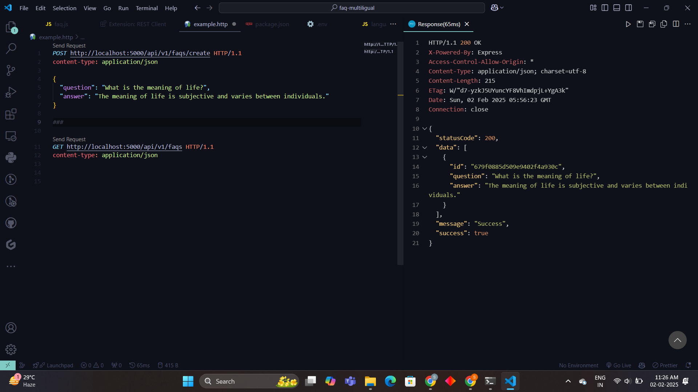

# FAQ Management API

Effortlessly manage your FAQs across multiple languages with our backend application that integrates the Google Translate API for seamless translations.

## Overview

This application offers a robust set of features designed to simplify the management of Frequently Asked Questions (FAQs) for any platform:

- **CRUD Operations**: Create, Read, Update, and Delete FAQs through RESTful API endpoints.
- **Multilingual Support**: Automatically translate FAQ content into multiple languages using the Google Translate API.
- **Code Quality & Stability**: Comprehensive testing with Mocha and Chai, and code linting with ESLint to ensure stability and maintainability.

---

## Technology Stack

### Server Environment

- **Node.js**  
  The runtime environment for the application. [Learn More](https://nodejs.org/en)
  
- **Express.js**  
  A flexible Node.js web framework used to build RESTful APIs. [Explore Express](https://expressjs.com/)

- **Mongoose**  
  An Object-Document Mapper (ODM) for MongoDB, simplifying database interactions. [Discover Mongoose](https://mongoosejs.com/)

- **jsdom**  
  A JavaScript implementation of web standards, used for DOM manipulation. [Learn More](https://www.npmjs.com/package/jsdom)

- **Google Translate API**  
  Provides real-time translations for FAQ content. (Ensure API credentials are configured.)

- **Mocha & Chai**  
  Testing framework and assertion library for robust API testing. [Mocha](https://mochajs.org/), [Chai](https://www.chaijs.com/)

- **ESLint**  
  Linter to ensure that the JavaScript code follows consistent and error-free practices. [Visit ESLint](https://eslint.org/)

---

## Prerequisites

Before starting, ensure that you have the following installed:

- **Git**: To clone the repository.
- **Node.js & npm**: For managing dependencies and running the application.
- **MongoDB**: A local or cloud MongoDB instance for data storage. Ensure that you have the connection URI ready.

---

## Getting Started

Follow these steps to set up and run the application locally:

### 1. Clone the Repository

```bash
git clone https://github.com/sivaprasadvitta/BharatFD_Assignment
```

### 2. Install Dependencies

```bash
npm install
```

### 3. Configure Environment Variables

Create a `.env` file in the root directory and add the following:

```
MONGO_URI=your_mongo_connection_uri
PORT=your_preferred_port_number
CLIENT=your_client_id || "*"
```

### 4. Start the Server

```bash
npm start
```

The application will now be running at `http://localhost:3000`.

---

## API Endpoints

### 1. **Create an FAQ**

- **URL**: `POST http://localhost:3000/api/v1/faqs/create`
- **Request Body** (JSON):

```json
{
  "question": "What is Node.js?",
  "answer": "Node.js is a JavaScript runtime built on Chrome's V8 JavaScript engine."
}
```

- **Response**:

```json
{
  "statusCode": 201,
  "message": "FAQ successfully created",
  "success": true,
  "data": {
    "id": "12345",
    "question": "What is Node.js?",
    "answer": "Node.js is a JavaScript runtime built on Chrome's V8 JavaScript engine."
  }
}
```

---

### 2. **Fetch All FAQs**

- **URL**: `GET http://localhost:3000/api/v1/faqs`
- **Response**:

```json
{
  "statusCode": 200,
  "message": "Success",
  "success": true,
  "data": [
    {
      "id": "12345",
      "question": "What is Node.js?",
      "answer": "Node.js is a JavaScript runtime built on Chrome's V8 JavaScript engine."
    },
    {
      "id": "67890",
      "question": "What is Express.js?",
      "answer": "Express.js is a minimal and flexible Node.js web application framework."
    }
  ]
}
```

---

### 3. **Fetch FAQ by ID**

- **URL**: `GET http://localhost:3000/api/v1/faqs/:id`
- **Response**:

```json
{
  "statusCode": 200,
  "message": "Success",
  "success": true,
  "data": {
    "id": "12345",
    "question": "What is Node.js?",
    "answer": "Node.js is a JavaScript runtime built on Chrome's V8 JavaScript engine."
  }
}
```

---

### 4. **Update an FAQ**

- **URL**: `PUT http://localhost:3000/api/v1/faqs/update`
- **Request Body** (JSON):

```json
{
  "id": "12345",
  "update": {
    "question": "What is Node.js? (Updated)",
    "answer": "Node.js is a JavaScript runtime used for building scalable applications."
  }
}
```

- **Response**:

```json
{
  "statusCode": 200,
  "message": "Successfully updated",
  "success": true,
  "data": {
    "id": "12345",
    "question": "What is Node.js? (Updated)",
    "answer": "Node.js is a JavaScript runtime used for building scalable applications."
  }
}
```

---

### 5. **Delete an FAQ**

- **URL**: `DELETE http://localhost:3000/api/v1/faqs/delete`
- **Request Body** (JSON):

```json
{
  "id": "12345"
}
```

- **Response**:

```json
{
  "statusCode": 200,
  "message": "Successfully deleted",
  "success": true
}
```

---

### 6. **Fetch FAQs in Another Language**

- **URL**: `GET http://localhost:3000/api/v1/faqs?lang={languageCode}`
  - Example for French (`fr`): `GET http://localhost:3000/api/v1/faqs?lang=fr`

- **Response** (Example in French):

```json
{
  "statusCode": 200,
  "message": "Succès",
  "success": true,
  "data": [
    {
      "id": "12345",
      "question": "Qu'est-ce que Node.js?",
      "answer": "Node.js est un environnement d'exécution JavaScript basé sur le moteur V8 de Chrome."
    }
  ]
}
```

You can also fetch a single FAQ in another language:

- **URL**: `GET http://localhost:3000/api/v1/faqs/:id?lang={languageCode}`
  - Example for Spanish (`es`): `GET http://localhost:3000/api/v1/faqs/12345?lang=hi`

- **Response** (Example in Hindi):

```json
{
  "statusCode": 200,
  "message": "success",
  "success": true,
  "data": {
    "id": "12345",
    "question": "Node.js क्या है?",
    "answer": "Node.js एक जावास्क्रिप्ट रनटाइम है जो क्रोम के V8 इंजन पर आधारित है।"
  }
}

```

---

## Example Screenshots
These are the sreenshots taken during testing
### 1. Create FAQ - HTTP Response (POST)


### 2. Fetch All FAQs - HTTP Response (GET)



---

## Conclusion

This API provides an easy-to-use backend for FAQ management with multilingual support. It integrates with MongoDB to store data and uses Google Translate API for real-time translations. The application is built with Node.js and Express.js and follows best practices for RESTful APIs, ensuring scalability and maintainability.
